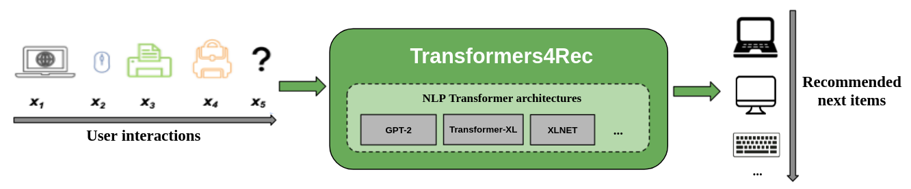
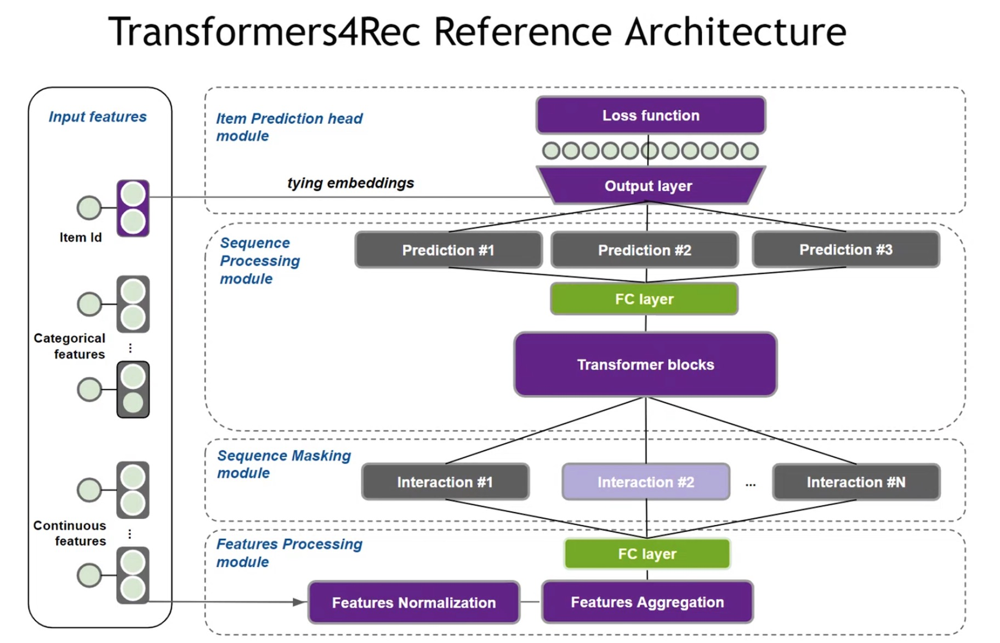
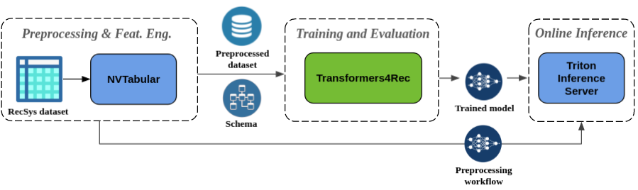

# Merlin - Transformers4Rec 

[toc]


# 1. Transformers4Rec简介




Transformers4Rec支持TensorFlow和PyTorch，编程接口简洁明了。

用户通过Transformers4Rec可以：

* 快速对用户短期内的行为序列进行建模进行推荐，如下一个商品推荐；
* 与NVtabular集成，可自动化处理数据输入，加速数据处理和特征提取流程。


## 1.1 基于会话推荐的SOTA模型

NVIDIA的团队使用基于Transformers4Rec的方案赢得了两场基于会话推荐模型比赛：[WSDM WebTour Workshop Challenge 2021](https://developer.nvidia.com/blog/how-to-build-a-winning-deep-learning-powered-recommender-system-part-3/), 以及[SIGIR eCommerce Workshop Data Challenge 2021](https://medium.com/nvidia-merlin/winning-the-sigir-ecommerce-challenge-on-session-based-recommendation-with-transformers-v2-793f6fac2994) ，并在[ACM RecSys21 论文](https://dl.acm.org/doi/10.1145/3460231.3474255) 对Transformers4Rec在基于会话推荐的场景中进行了广泛的评估，显示Transformers4Rec比baseline算法更准确。



## 1.2 功能介绍

- **灵活性**：可以和PyTorch和 TF Keras结合使用，可以自定义网络结构，例如multiple towers, multiple heads/tasks，和losses。

- **支持多种输入Features**：HuggingFace Transformers仅支持Token ID序列作为输入特征；Transformers4Rec可以使用表格类的数据序列作为Transformers的输入特征。Transformers4Rec使用一种`schema format`来配置输入特征，并自动创建必要的层（例如embedding tables, projection layer, output layers)。

- **预处理和特征工程**: 得益于和NVTabular的集成，Transformers4Rec提供了基于会话推荐模型的常用预处理ops，并能导成Transformers4Rec兼容的数据格式，因此可以实现输入特征的自动配置。




# 2. 使用范例 (Tensorflow)

## 2.1 准备工作

* 硬件环境：安装有英伟达GPU的服务器或工作站
  
* 操作系统和软件：建议使用Linux操作系统（如Ubuntu），安装GPU驱动、Docker以及[NVIDIA Container Toolkit](https://github.com/NVIDIA/nvidia-docker) 

* 注册NGC：https://ngc.nvidia.com

以上具体步骤请参见 https://docs.nvidia.com 和其他相关文档。

* 获取Transformers4Rec代码，并使用 `v0.1.8` 分支; 从NGC下载相关镜像文件 

```bash
export YOUR_HOST_WORKSPACE=/your/path
docker pull nvcr.io/nvidia/merlin/merlin-tensorflow-training:22.05
docker pull nvcr.io/nvidia/merlin/merlin-inference:22.05

cd ${YOUR_HOST_WORKSPACE}
git clone https://github.com/NVIDIA-Merlin/Transformers4Rec.git
cd Transformers4Rec
git checkout -t v0.1.8
```

## 2.2 数据和ETL

1. **准备数据**
   

到 https://www.kaggle.com/chadgostopp/recsys-challenge-2015 下载 `yoochoose-clicks.dat.zip` 文件；并解压到主机上的目录, e.g. `${YOUR_HOST_WORKSPACE}/data/`


2. **在主机上运行`merlin-pytorch-training`镜像**

```bash
# port mapping will be ignored when add --network=host flag
docker run --runtime=nvidia --rm -it -p 8888:8888 -p 8787:8787 -p 8786:8786 \
            -v ${YOUR_HOST_WORKSPACE}:/workspace  \
            --ipc=host --cap-add SYS_NICE \
            --network=host \
            nvcr.io/nvidia/merlin/merlin-tensorflow-training:22.05 /bin/bash
```
**在容器内启动jupyter-lab**

```bash
cd /workspace/
jupyter-lab --allow-root --ip='0.0.0.0' --NotebookApp.token=''
```

3. **运行 `ETL-with-NVTabular` Notebook**

在浏览器中打开jupyter-lab对应的URL，运行 `Transformers4Rec/examples/end-to-end-session-based` 下的 `01-ETL-with-NVTabular.ipynb`

```
preproc_sessions_by_day/
    181/
        valid.parquet
        train.parquet
        test.parquet
    178/
        valid.parquet
        train.parquet
        test.parquet
    180/
        valid.parquet
        train.parquet
        test.parquet
    179/
        valid.parquet
        train.parquet
        test.parquet
    182/
        valid.parquet
        train.parquet
        test.parquet
```


## 2.3 训练模型

在浏览器中打开jupyter-lab对应的URL，运行 `Transformers4Rec/examples/end-to-end-session-based` 下的 `03-End-to-end-session-based-with-Yoochoose-TF.ipynb` 中的第一到第三个部分。

`03-End-to-end-session-based-with-Yoochoose-TF.ipynb` 第一到第三个部分相关代码的简要介绍：

* 从`schema_demo.pb`文件中读取预定义的数据schema 

* 创建一个基于会话（session-based）的推荐模型:
  
    1. 根据`schema`，创建为embedding table创建一个[TabularSequenceFeatures](https://nvidia-merlin.github.io/Transformers4Rec/main/api/transformers4rec.tf.features.html?highlight=tabularsequence#transformers4rec.tf.features.sequence.TabularSequenceFeatures) 对象
    2. 使用[NextItemPredictionTask](https://nvidia-merlin.github.io/Transformers4Rec/main/api/transformers4rec.tf.model.html?highlight=nextitem#transformers4rec.tf.model.prediction_task.NextItemPredictionTask) 定义一个或多个预测任务
    3. 根据输入，预测任务，和创建的 `transformer_config` 对象，创建一个Tensorflow `Model`类的实例.

* 使用NVTabular提供的`KerasSequenceLoader` Dataloader，来加速从parquet文件中加载训练数据.
   * 关于NVTabular更多介绍，请参见以下链接: [link1](https://nvidia-merlin.github.io/NVTabular/main/training/tensorflow.html), [link2](https://medium.com/nvidia-merlin/training-deep-learning-based-recommender-systems-9x-faster-with-tensorflow-cc5a2572ea49) 

* 定义优化器，并使用model.fit 和model.evaluate接口分别执行模型训练和评估

* 使用 `export_tensorflow_ensemble` 接口把训练后的模型推理Pipeline导出成Triton Model Ensemble, 并保存到指定目录 (如容器内的 `'/workspace/TF4Rec/models/tf/'`)

训练完成并导出模型后，在`/workspace/TF4Rec`目录得到以下文件:

```
TF4Rec/
└── models
    └── tf
        ├── t4r_tf
        │   ├── 1
        │   └── config.pbtxt
        ├── t4r_tf_nvt
        │   ├── 1
        │   │   ├── model.py
        │   │   └── workflow
        │   │       ├── categories
        │   │       │   ├── unique.category.parquet
        │   │       │   ├── unique.item_id.parquet
        │   │       │   └── unique.session_id.parquet
        │   │       ├── metadata.json
        │   │       └── workflow.pkl
        │   └── config.pbtxt
        └── t4r_tf_tf
            ├── 1
            │   └── model.savedmodel
            │       ├── assets
            │       ├── keras_metadata.pb
            │       ├── saved_model.pb
            │       └── variables
            │           ├── variables.data-00000-of-00001
            │           └── variables.index
            └── config.pbtxt

13 directories, 13 files
```

## 2.4 推理

1. **运行 Triton Server**

在**主机环境**中运行merlin-inference容器:

```bash
# port mapping will be ignored when add --network=host flag
docker run -it --gpus device=0 -p 8000:8000 -p 8001:8001 -p 8002:8002 \
         -v ${YOUR_HOST_WORKSPACE}/TF4Rec/models/tf/:/workspace/models/ \
         --ipc=host \
         --network=host \
         nvcr.io/nvidia/merlin/merlin-inference:22.05 /bin/bash
```

在merlin-inference容器内，启动`tritonserver` (这里的 `<path_to_models>` 就是 `/workspace/models/`目录)

```bash
tritonserver --model-repository=<path_to_models> --backend-config=tensorflow,version=2 --model-control-mode=explicit
```


2. **继续在Notebook中运行 Triton客户端**

开始前，确保可以在`merlin-tensorflow-training:22.05`容器中能访问到 `merlin-inference:22.05` 容器的相关端口（如`8000`)。

在浏览器中打开`merlin-tensorflow-training:22.05` 上jupyter-lab对应的URL，继续运行 `Transformers4Rec/examples/end-to-end-session-based` 下的 `03-End-to-end-session-based-with-Yoochoose-TF.ipynb` 中的第四个部分 `4. Serving Ensemble Model to the Triton Inference Server`。

`03-End-to-end-session-based-with-Yoochoose-TF.ipynb` 第四部分相关代码的简要介绍：

* Triton客户端和 Triton服务器建议连接: `triton_client = tritonhttpclient.InferenceServerClient(url="localhost:8000")`
* Triton客户端发起请求，让Triton服务器加载`t4r_tf`模型: `triton_client.load_model(model_name="t4r_tf")`
* 使用`nvt_triton.convert_df_to_triton_input` API准备好测试用的客户端请求payload 
* 向服务端发送推理请求，并获得返回结果: `response = client.infer(MODEL_NAME_NVT, inputs)`


# 3. 附录


## 3.1 参考资料

* Transformers4Rec [source code](https://github.com/NVIDIA-Merlin/Transformers4Rec/)
* Transformers4Rec [documentation](https://nvidia-merlin.github.io/Transformers4Rec/main/getting_started.html)
* Transformers4Rec [API documentation](https://nvidia-merlin.github.io/Transformers4Rec/main/api/modules.html)
* Transformers4Rec在ACM RecSys21的 [论文](https://dl.acm.org/doi/10.1145/3460231.3474255)
* Merlin NVTabular: https://github.com/NVIDIA-Merlin/NVTabular/tree/main/nvtabular
* Triton inference server: https://github.com/triton-inference-server

## 3.2 相关的容器镜像

| Container Name             | Container Location | Functionality |
| -------------------------- | ------------------ | ------------- |
| merlin-tensorflow-training | [https://ngc.nvidia.com/catalog/containers/nvidia:merlin:merlin-tensorflow-training](https://ngc.nvidia.com/catalog/containers/nvidia:merlin:merlin-tensorflow-training) | Transformers4Rec, NVTabular, TensorFlow, and HugeCTR Tensorflow Embedding plugin |
| merlin-pytorch-training    | [https://ngc.nvidia.com/catalog/containers/nvidia:merlin:merlin-pytorch-training](https://ngc.nvidia.com/catalog/containers/nvidia:merlin:merlin-pytorch-training)    | Transformers4Rec, NVTabular and PyTorch
| merlin-inference           | [https://ngc.nvidia.com/catalog/containers/nvidia:merlin:merlin-inference](https://ngc.nvidia.com/catalog/containers/nvidia:merlin:merlin-inference)           | Transformers4Rec, NVTabular, PyTorch, and Triton Inference |  |
