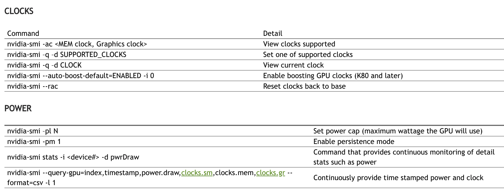

#  NVIDIA System Management Interface (nvidia-smi) and Management Library (NVML)

##  nvidia-smi


常用命令

```bash
nvidia-smi --query-gpu=timestamp,name,pci.bus_id,driver_version,pstate,pcie.link.gen.max, pcie.link.gen.current,temperature.gpu,utilization.gpu,utilization.memory, memory.total,memory.free,memory.used --format=csv -l 5


nvidia-smi --query-gpu=timestamp,name,utilization.gpu,utilization.memory, --format=csv -lms 1000


nvidia-smi --query-gpu=timestamp,name,pci.bus_id,driver_version,pstate,pcie.link.gen.max, pcie.link.gen.current,temperature.gpu,utilization.gpu,utilization.memory, memory.total,memory.free,memory.used --format=csv -lms 5
```



详见: http://nvidia.custhelp.com/app/answers/detail/a_id/3751/~/useful-nvidia-smi-queries


#### nvidia-smi 查询


| Term      | Description |
| :---:        |    :----  |
|Fan                |      风扇转速（0%--100%），N/A表示没有风扇                                          |
|Temp               |   GPU温度（GPU温度过高会导致GPU频率下降）                                             |
|Perf               |      性能状态，从P0（最大性能）到P12（最小性能）                                          |
|Pwr                |      GPU功耗                                                             |
|Persistence-M    	|	持续模式的状态（持续模式耗能大，但在新的GPU应用启动时花费时间更少）             |
|Bus-Id             |   	GPU总线，domain:bus:device.function                                 |
|Disp.A             |    Display Active，表示GPU的显示是否初始化                                        |
|Memory-Usage 		|	显存使用率                                                                |
|Volatile GPU-Util 	|	GPU使用率                                                               |
|ECC                |    是否开启错误检查和纠正技术，0/DISABLED, 1/ENABLED                          |
|Compute M.      	|	计算模式，0/DEFAULT,1/EXCLUSIVE_PROCESS,2/PROHIBITED |


| Command      | Description |
| :---:        |    :----  |
|nvidia-smi -q -i xxx -f xxx  |     指定具体的GPU或unit信息;将查询的信息输出到具体的文件中，不在终端显示 |
|nvidia-smi -q -d xxx         |   指定显示GPU卡某些信息，xxx参数可以为MEMORY, UTILIZATION, ECC, TEMPERATURE, POWER,CLOCK, COMPUTE, PIDS, PERFORMANCE, SUPPORTED_CLOCKS, PAGE_RETIREMENT,ACCOUNTING |
|nvidia-smi -q -l xxx         |   动态刷新信息，可指定刷新频率，以秒为单位 |
|nvidia-smi --query-gpu=gpu_name,gpu_bus_id,vbios_version--format=csv     |       选择性查询选项，可以指定显示的属性选项 可查看的属性有 timestamp，driver_version，pci.bus，pcie.link.width.current等。（可查看nvidia-smi--help-query-gpu来查看有哪些属性）|

 

#### 设置GPU卡设备的状态选项

| Command      | Description |   
| :---:        |    :----  |     
|nvidia-smi -pm 0/1    |          设置持久模式 0/DISABLED,1/ENABLED                                |
|nvidia-smi -e 0/1     |          切换ECC支持 0/DISABLED, 1/ENABLED                              |
|nvidia-smi -p 0/1     |      重置ECC错误计数 0/VOLATILE, 1/AGGREGATE                              |
|nvidia-smi -c.        |      设置计算应用模式 0/DEFAULT,1/EXCLUSIVE_PROCESS,2/PROHIBITED            |
|nvidia-smi -r         |      GPU复位                                                          |
|nvidia-smi -vm.       |      设置GPU虚拟化模式                                                     |
|nvidia-smi -ac xxx,xxx|      设置GPU运行的工作频率。e.g. nvidia-smi -ac2000,800                       |
|nvidia-smi -rac 	|			将时钟频率重置为默认值                                                  |
|nvidia-smi -acp 0/1   |  切换-ac和-rac的权限要求，0/UNRESTRICTED, 1/RESTRICTED                       |
|nvidia-smi -pl  	   | 指定最大电源管理限制（瓦特）                                                      |
|nvidia-smi -am 0/1.   |  启用或禁用计数模式，0/DISABLED,1/ENABLED                                     |
|nvidia-smi -caa.      |  清除缓冲区中的所有已记录PID，0/DISABLED,1/ENABLED                               |


#### 设备监控命令 (`nvidia-smi dmon`)

设备监控命令，以滚动条形式显示GPU设备统计信息。监控最多4个GPU，如果没有指定任何GPU，则默认监控GPU0-GPU3（GPU索引从0开始）。

```
nvidia-smi dmon -s "pucet" -i 0 -o "DT" -d 2
#Date       Time        gpu   pwr gtemp mtemp    sm   mem   enc   dec  mclk  pclk sbecc dbecc   pci rxpci txpci
#YYYYMMDD   HH:MM:SS    Idx     W     C     C     %     %     %     %   MHz   MHz  errs  errs  errs  MB/s  MB/s
 20210102   19:12:31      0    37    19     -     0     0     0     0  4006   582     -     -     0     0     1
 20210102   19:12:33      0    39    19     -     0     0     0     0  4006  1582     -     -     0     0     0
 20210102   19:12:35      0    39    19     -     0     0     0     0  4006  1582     -     -     0     0     0
```

附加选项 

| Command      | Description |
| :---:        |    :----  |     
|nvidia-smi dmon -i          |                                                     |
|nvidia-smi dmon -d xxx		 |  指定刷新时间（默认为1秒）                                      |
|nvidia-smi dmon -c xxx 	|	显示指定数目的统计信息并退出                                     |
|nvidia-smi dmon -o "DT" 	|	指定显示的时间格式D YYYYMMDD，TH                             |
|nvidia-smi dmon -f log.txt |		将查询的信息输出到具体的文件中，不在终端显示                         |
|nvidia-smi dmon -s "puc"    |  指定显示哪些监控指标（默认为puc），其中                              |


| metrics for `-s`     | Description |
| :---:        |    :----  |
|p | 电源使用情况和温度（pwr 功耗，temp 温度）                          |
|u | GPU使用率（sm 流处理器，mem 显存，enc 编码资源，dec 解码资源）           |
|c | GPU处理器和GPU内存时钟频率（mclk 显存频率，pclk 处理器频率）             |
|v | 电源和热力异常                                            |
|m | FB内存和Bar1内存                                        |
|e | ECC错误和PCIe重显错误个数                                   |
|t | PCIe读写带宽                                           |


| Syntax      | Description | Test Text     |
| :---        |    :----:   |          ---: |
| Header      | Title       | Here's this   |
| Paragraph   | Text        | And more      |

#### 在Windows上使用 `nvidia-smi`

- nvidia-smi所在的位置为：`C:\Program Files\NVIDIA Corporation\NVSMI`
- 建议添加路径到系统的 `PATH` 变量进行编辑

## NVIDIA Management Library (NVML)

```
----------------------------------------------------------
| nvidia-smi | python binding | 						 |
----------------------------------------------------------
|		NVIDIA Management Library (NVML)				 |
----------------------------------------------------------
```

- 安装Python包 `pip install nvidia-ml-py`
- NVML API[手册](https://docs.nvidia.com/deploy/nvml-api/nvml-api-reference.html)


## 附录

#### nvidia-smi manual

```
NVIDIA System Management Interface -- v418.67

NVSMI provides monitoring information for Tesla and select Quadro devices.
The data is presented in either a plain text or an XML format, via stdout or a file.
NVSMI also provides several management operations for changing the device state.

Note that the functionality of NVSMI is exposed through the NVML C-based
library. See the NVIDIA developer website for more information about NVML.
Python wrappers to NVML are also available.  The output of NVSMI is
not guaranteed to be backwards compatible; NVML and the bindings are backwards
compatible.

http://developer.nvidia.com/nvidia-management-library-nvml/
http://pypi.python.org/pypi/nvidia-ml-py/
Supported products:
- Full Support
    - All Tesla products, starting with the Kepler architecture
    - All Quadro products, starting with the Kepler architecture
    - All GRID products, starting with the Kepler architecture
    - GeForce Titan products, starting with the Kepler architecture
- Limited Support
    - All Geforce products, starting with the Kepler architecture
nvidia-smi [OPTION1 [ARG1]] [OPTION2 [ARG2]] ...

    -h,   --help                Print usage information and exit.

  LIST OPTIONS:

    -L,   --list-gpus           Display a list of GPUs connected to the system.

    -B,   --list-blacklist-gpus Display a list of blacklisted GPUs in the system.

  SUMMARY OPTIONS:

    <no arguments>              Show a summary of GPUs connected to the system.

    [plus any of]

    -i,   --id=                 Target a specific GPU.
    -f,   --filename=           Log to a specified file, rather than to stdout.
    -l,   --loop=               Probe until Ctrl+C at specified second interval.

  QUERY OPTIONS:

    -q,   --query               Display GPU or Unit info.

    [plus any of]

    -u,   --unit                Show unit, rather than GPU, attributes.
    -i,   --id=                 Target a specific GPU or Unit.
    -f,   --filename=           Log to a specified file, rather than to stdout.
    -x,   --xml-format          Produce XML output.
          --dtd                 When showing xml output, embed DTD.
    -d,   --display=            Display only selected information: MEMORY,
                                    UTILIZATION, ECC, TEMPERATURE, POWER, CLOCK,
                                    COMPUTE, PIDS, PERFORMANCE, SUPPORTED_CLOCKS,
                                    PAGE_RETIREMENT, ACCOUNTING, ENCODER_STATS, FBC_STATS
                                Flags can be combined with comma e.g. ECC,POWER.
                                Sampling data with max/min/avg is also returned
                                for POWER, UTILIZATION and CLOCK display types.
                                Doesn't work with -u or -x flags.
    -l,   --loop=               Probe until Ctrl+C at specified second interval.

    -lms, --loop-ms=            Probe until Ctrl+C at specified millisecond interval.

  SELECTIVE QUERY OPTIONS:

    Allows the caller to pass an explicit list of properties to query.

    [one of]

    --query-gpu=                Information about GPU.
                                Call --help-query-gpu for more info.
    --query-supported-clocks=   List of supported clocks.
                                Call --help-query-supported-clocks for more info.
    --query-compute-apps=       List of currently active compute processes.
                                Call --help-query-compute-apps for more info.
    --query-accounted-apps=     List of accounted compute processes.
                                Call --help-query-accounted-apps for more info.
    --query-retired-pages=      List of device memory pages that have been retired.
                                Call --help-query-retired-pages for more info.

    [mandatory]

    --format=                   Comma separated list of format options:
                                  csv - comma separated values (MANDATORY)
                                  noheader - skip the first line with column headers
                                  nounits - don't print units for numerical
                                             values

    [plus any of]

    -i,   --id=                 Target a specific GPU or Unit.
    -f,   --filename=           Log to a specified file, rather than to stdout.
    -l,   --loop=               Probe until Ctrl+C at specified second interval.
    -lms, --loop-ms=            Probe until Ctrl+C at specified millisecond interval.

  DEVICE MODIFICATION OPTIONS:

    [any one of]

    -pm,  --persistence-mode=   Set persistence mode: 0/DISABLED, 1/ENABLED
    -e,   --ecc-config=         Toggle ECC support: 0/DISABLED, 1/ENABLED
    -p,   --reset-ecc-errors=   Reset ECC error counts: 0/VOLATILE, 1/AGGREGATE
    -c,   --compute-mode=       Set MODE for compute applications:
                                0/DEFAULT, 1/EXCLUSIVE_PROCESS,
                                2/PROHIBITED
          --gom=                Set GPU Operation Mode:
                                    0/ALL_ON, 1/COMPUTE, 2/LOW_DP
    -r    --gpu-reset           Trigger reset of the GPU.
                                Can be used to reset the GPU HW state in situations
                                that would otherwise require a machine reboot.
                                Typically useful if a double bit ECC error has
                                occurred.
                                Reset operations are not guarenteed to work in
                                all cases and should be used with caution.
    -vm   --virt-mode=          Switch GPU Virtualization Mode:
                                Sets GPU virtualization mode to 3/VGPU or 4/VSGA
                                Virtualization mode of a GPU can only be set when
                                it is running on a hypervisor.
    -lgc  --lock-gpu-clocks=    Specifies <minGpuClock,maxGpuClock> clocks as a
                                    pair (e.g. 1500,1500) that defines the range
                                    of desired locked GPU clock speed in MHz.
                                    Setting this will supercede application clocks
                                    and take effect regardless if an app is running.
                                    Input can also be a singular desired clock value
                                    (e.g. <GpuClockValue>).
    -rgc  --reset-gpu-clocks
                                Resets the Gpu clocks to the default values.
    -ac   --applications-clocks= Specifies <memory,graphics> clocks as a
                                    pair (e.g. 2000,800) that defines GPU's
                                    speed in MHz while running applications on a GPU.
    -rac  --reset-applications-clocks
                                Resets the applications clocks to the default values.
    -acp  --applications-clocks-permission=
                                Toggles permission requirements for -ac and -rac commands:
                                0/UNRESTRICTED, 1/RESTRICTED
    -pl   --power-limit=        Specifies maximum power management limit in watts.
    -cc   --cuda-clocks=        Overrides or restores default CUDA clocks.
                                In override mode, GPU clocks higher frequencies when running CUDA applications.
                                Only on supported devices starting from the Volta series.
                                Requires administrator privileges.
                                0/RESTORE_DEFAULT, 1/OVERRIDE
    -am   --accounting-mode=    Enable or disable Accounting Mode: 0/DISABLED, 1/ENABLED
    -caa  --clear-accounted-apps
                                Clears all the accounted PIDs in the buffer.
          --auto-boost-default= Set the default auto boost policy to 0/DISABLED
                                or 1/ENABLED, enforcing the change only after the
                                last boost client has exited.
          --auto-boost-permission=
                                Allow non-admin/root control over auto boost mode:
                                0/UNRESTRICTED, 1/RESTRICTED
   [plus optional]

    -i,   --id=                 Target a specific GPU.

  UNIT MODIFICATION OPTIONS:

    -t,   --toggle-led=         Set Unit LED state: 0/GREEN, 1/AMBER

   [plus optional]

    -i,   --id=                 Target a specific Unit.

  SHOW DTD OPTIONS:

          --dtd                 Print device DTD and exit.

     [plus optional]

    -f,   --filename=           Log to a specified file, rather than to stdout.
    -u,   --unit                Show unit, rather than device, DTD.

    --debug=                    Log encrypted debug information to a specified file.

 STATISTICS: (EXPERIMENTAL)
    stats                       Displays device statistics. "nvidia-smi stats -h" for more information.

 Device Monitoring:
    dmon                        Displays device stats in scrolling format.
                                "nvidia-smi dmon -h" for more information.

    daemon                      Runs in background and monitor devices as a daemon process.
                                This is an experimental feature. Not supported on Windows baremetal
                                "nvidia-smi daemon -h" for more information.

    replay                      Used to replay/extract the persistent stats generated by daemon.
                                This is an experimental feature.
                                "nvidia-smi replay -h" for more information.

 Process Monitoring:
    pmon                        Displays process stats in scrolling format.
                                "nvidia-smi pmon -h" for more information.

 TOPOLOGY:
    topo                        Displays device/system topology. "nvidia-smi topo -h" for more information.

 DRAIN STATES:
    drain                       Displays/modifies GPU drain states for power idling. "nvidia-smi drain -h" for more information.

 NVLINK:
    nvlink                      Displays device nvlink information. "nvidia-smi nvlink -h" for more information.

 CLOCKS:
    clocks                      Control and query clock information. "nvidia-smi clocks -h" for more information.

 ENCODER SESSIONS:
    encodersessions             Displays device encoder sessions information. "nvidia-smi encodersessions -h" for more information.

 FBC SESSIONS:
    fbcsessions                 Displays device FBC sessions information. "nvidia-smi fbcsessions -h" for more information.

 GRID vGPU:
    vgpu                        Displays vGPU information. "nvidia-smi vgpu -h" for more information.

Please see the nvidia-smi(1) manual page for more detailed information.

```


#### Reference


- https://blog.csdn.net/C_chuxin/article/details/82993350